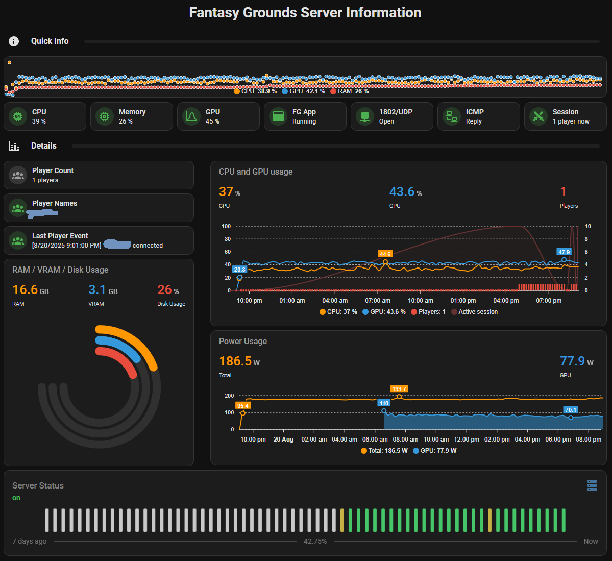

# FG-monitoring
Fantasy Grounds → Home Assistant (Windows + MQTT)

PowerShell scripts to monitor a Fantasy Grounds Unity server on Windows and auto-expose rich sensors in Home Assistant via MQTT Discovery. No configuration.yaml edits required — everything appears under one device in the MQTT integration.

* App running / port listening / availability
* Player count, names, and last player event
* CPU %, RAM %, RAM used/total, disk free %/GB (per drive)
* NVIDIA GPU: util %, VRAM used/total, GPU power (W) (+ limit if available)
* Clean HA Discovery payloads (UTF-8 no BOM, retained) with sensible expire_after

Your Home Assistant dashboard YAML is in docs/fg-dashboard.yaml.

# Dashboard screenshot


# How it works

Both scripts publish MQTT Discovery config and state messages. Home Assistant subscribes, creates entities automatically, and keeps them updated on a schedule (e.g., every minute via Task Scheduler).

## `fg-ha-monitor.ps1`
* Detects FGU by process name/path.
* Confirms the host is listening on UDP 1802 (configurable, with TCP/netstat fallbacks).
* Rebuilds the current player list from the tail of console.log (and optionally network.log) every run — robust to restarts and log rotation.

Publishes:
* binary_sensor.fantasy_grounds_server_fg_app_running
* binary_sensor.fantasy_grounds_server_fg_port_listening
* sensor.fantasy_grounds_server_fg_player_count
* sensor.fantasy_grounds_server_fg_player_names
* sensor.fantasy_grounds_server_fg_last_player_event (persistent; no expiry)

## `fg-ha-stats.ps1`
* Locale-safe CPU via WMI/CIM (Win32_PerfFormattedData_PerfOS_Processor).
* Memory totals/usage via Win32_OperatingSystem.
* Disk free %/GB for all fixed drives.
* NVIDIA metrics via nvidia-smi (auto-located): util %, VRAM used/total, GPU power (W), power limit (W).
* Publishes sensors under the same device.

All non-event sensors include expire_after (default 180s) so they go Unavailable if the task stops.

## `schedule-fg-ha.ps1`
* Script for scheduling tasks
* Default set to schedule both scripts every minute

# Prerequisites
* Windows Server / Windows 10+ with PowerShell 5.1+ (PowerShell 7 also fine).
* Fantasy Grounds Unity installed (set $FGRoot, default C:\FG).
* MQTT broker reachable from the server (e.g., Mosquitto add-on in Home Assistant).
* mosquitto_pub.exe installed on Windows
  (default path: C:\Program Files\mosquitto\mosquitto_pub.exe).
* NVIDIA driver tools (nvidia-smi.exe) available. The script searches:
  * C:\Windows\System32\nvidia-smi.exe
  * C:\Program Files\NVIDIA Corporation\NVSMI\PATH
* (Optional) A smart plug with power monitoring for whole-server watts and energy/cost in HA (e.g., Shelly Plug, Tapo P115, Kasa KP115, Sonoff POW/POWR3).
* Authentication: If your MQTT broker uses a username/password, set $mqttUser/$mqttPass in each script. !Credentials are stored in plain text!

# Install

## 1. Copy the scripts here

```
C:\Scripts\fg-ha-monitor.ps1
C:\Scripts\fg-ha-stats.ps1
```

## 2. Edit settings at the top of each script:
* Broker host/IP, port, TLS ($useTls), $mqttUser/$mqttPass
* $topicBase (default fg/server) and $discovery (default homeassistant)
* Device metadata ($deviceId, $deviceName)
* fg-ha-monitor.ps1: $FGRoot (FG install with console.log), $FGPort (default 1802)
* Paths to mosquitto_pub.exe and (for stats) nvidia-smi.exe (auto-found)

## 3. Run each script once (publishes discovery + first state)

```powershell
powershell -NoProfile -ExecutionPolicy Bypass -File C:\Scripts\fg-ha-monitor.ps1
powershell -NoProfile -ExecutionPolicy Bypass -File C:\Scripts\fg-ha-stats.ps1
```

## 4. Home Assistant → MQTT → Reload
* Settings → Devices & Services → MQTT → ⋮ Reload.
* You should now see a device named Fantasy Grounds Server with entities.

## 5. Schedule them (every minute)
* Edit `schedule-fg-ha.ps1` to match your preferences

### Run the script once (in Powershell):

```powershell
powershell -NoProfile -ExecutionPolicy Bypass -File C:\Scripts\schedule-fg-ha.ps1
```

### Verify / inspect (also PowerShell):

```powershell
Get-ScheduledTask -TaskName "FG-HA-Monitor","FG-HA-Stats" | Get-ScheduledTaskInfo | Format-List *
```

### Unschedule jobs (if needed - don't do this if you want the jobs to run)

```powershell
Unregister-ScheduledTask -TaskName "FG-HA-Monitor" -Confirm:$false -ErrorAction SilentlyContinue
Unregister-ScheduledTask -TaskName "FG-HA-Stats"   -Confirm:$false -ErrorAction SilentlyContinue
```


# Topics & Entities (quick map)

* Discovery prefix homeassistant/…, state prefix $topicBase (default fg/server).
* app_running → binary_sensor.fantasy_grounds_server_fg_app_running (true|false, device_class connectivity)
* port_listening → binary_sensor.fantasy_grounds_server_fg_port_listening
* player_count → sensor.fantasy_grounds_server_fg_player_count (int)
* player_names → sensor.fantasy_grounds_server_fg_player_names (csv string)
* last_event → sensor.fantasy_grounds_server_fg_last_player_event (retained, no expiry)
* stats/cpu_percent → sensor.fantasy_grounds_server_fg_cpu
* stats/memory_percent|_used_mb|_total_mb
* stats/disk/<drive>/free_percent|free_gb (per drive, e.g., disk/c/free_gb)
* stats/gpu/<id>/util_percent|vram_used_mb|vram_total_mb|power_w|power_limit_w

All also share availability topic fg/server/availability (online retained).

# Dashboard
* A ready-made FG dashboard is in:
  * `docs/fg-dashboard.yaml`
  * `docs/fg-dashboard.png` (screenshot)

Import via Edit dashboard → Raw configuration editor (or add cards individually). Edit to fit your
environment and sensors ;-)

My dashboard have these additional components:
* Ping (ICMP) integration for pinging the server (https://www.home-assistant.io/integrations/ping/)
* Mushroom cards (HACS) (https://github.com/piitaya/lovelace-mushroom)
* Bubble cards (HACS) (https://github.com/Clooos/Bubble-Card)
* Apexchart cards (HACS) (https://github.com/RomRider/apexcharts-card)
* Uptime card (HACS) (https://github.com/dylandoamaral/uptime-card)

# (Optional) Power & Cost (smart plug recommended)
* Add a plug with power monitoring in HA (Shelly, Tapo P115, Kasa KP115, Sonoff POW, etc.).
  * You’ll get sensor.<plug>_power (W) and …_energy (kWh) automatically.
* Do a calculation with current electricity prices (Nordpool or whatever your country provides) to get daily/monthly cost if you want :-)

# License

Apache 2.0 — see `LICENSE`.

# Credits
* Home Assistant MQTT Discovery
* NVIDIA nvidia-smi
* Chat-GPT for helping with Powershell issues (first time I've tried Powershell...)
* Inspiration: many community snippets; this repo unifies them for FGU on Windows.

# Changelog
* v1.1 – GPU power (W) added; last_event made persistent; robust UTF-16 log parsing; empty MQTT payloads via -n.
* v1.0 – Initial release (FG app/port/players + server CPU/RAM/Disk + GPU util/VRAM).
